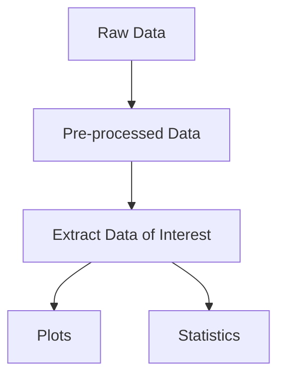

# Multi-fidelity Bayesian Machine Learning for global optimization - data wrangling and postprocessing scripts

## Project structure

Core structure of the folder:
```text
data/                           #  Data gathered from the experiment
    data/raw/                   #  Raw data (BOSS output files)
    data/processed/             #  Pre-processed data (JSON files)
docs/                           #  Documentation of results
env/                            #  Virtual environment to process data & create plots
references/                     #  References related to the project
results/                        #  Results, including plots and tables
scripts/                        #  Scripts to process data and create plots
src/                            #  Functionalities used within the project folder
tests/                          #  Tests for the pre-processing
```


